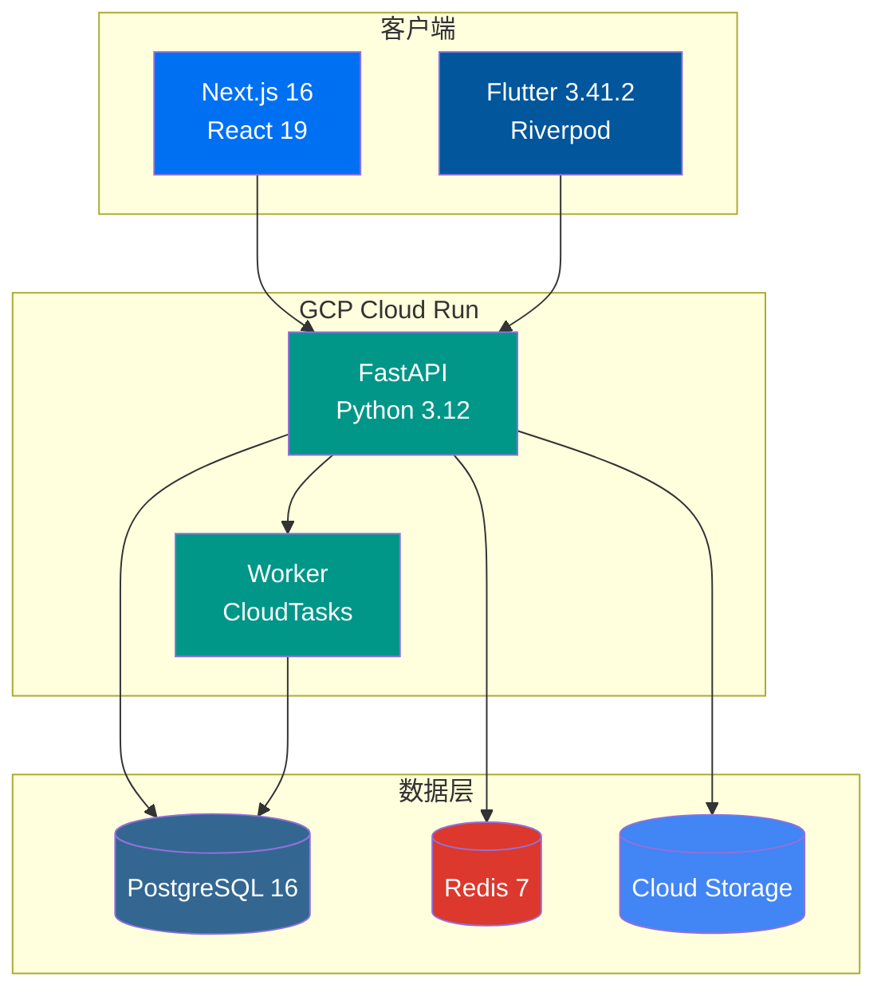
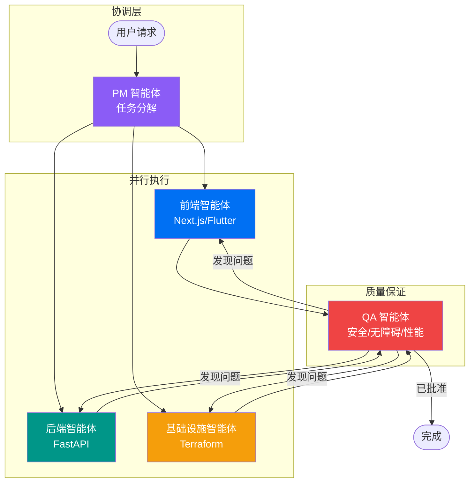

# Fullstack Starter

[](https://github.com/first-fluke/fullstack-starter/stargazers)
[](https://github.com/first-fluke/fullstack-starter)
[](https://github.com/first-fluke/fullstack-starter/releases)
[](https://deepwiki.com/first-fluke/fullstack-starter)

[English](../README.md) | [한국어](./README.ko.md) | 简体中文 | [日本語](./README.jp.md) | [Português](./README.pt.md)

> 模板版本通过 [Release Please](https://github.com/googleapis/release-please) 管理 — 查看 [CHANGELOG.md](../CHANGELOG.md) 了解发布历史。

生产就绪的全栈 monorepo 模板，集成 Next.js 16、FastAPI、Flutter 和 GCP 基础设施。

### 3 层架构



## 核心特性

- **现代技术栈**: Next.js 16 + React 19, FastAPI, Flutter 3.41.2, TailwindCSS v4
- **类型安全**: TypeScript、Pydantic 和 Dart 全栈类型支持
- **身份验证**: 基于 better-auth 的 OAuth（Google、GitHub、Facebook）
- **国际化 (i18n)**: next-intl（Web）、Flutter ARB（移动端）、共享 i18n 包
- **API 客户端自动生成**: Orval（Web）、swagger_parser（移动端）
- **基础设施即代码**: Terraform + GCP（Cloud Run、Cloud SQL、Cloud Storage）
- **CI/CD**: GitHub Actions + Workload Identity Federation（无密钥部署）
- **AI 智能体支持**: 面向 AI 编程助手（Gemini、Claude 等）的指南
- **mise Monorepo**: 基于 mise 的任务管理和统一工具版本

## 技术栈

| 层级 | 技术 |
|------|------|
| **前端** | Next.js 16, React 19, TailwindCSS v4, shadcn/ui, TanStack Query, Jotai |
| **后端** | FastAPI, SQLAlchemy (async), PostgreSQL 16, Redis 7 |
| **移动端** | Flutter 3.41.2, Riverpod 3, go_router 17, Firebase Crashlytics, Fastlane |
| **Worker** | FastAPI + CloudTasks/PubSub |
| **基础设施** | Terraform, GCP（Cloud Run、Cloud SQL、Cloud Storage、CDN） |
| **CI/CD** | GitHub Actions, Workload Identity Federation |
| **工具管理** | mise（统一 Node、Python、Flutter、Terraform 版本） |

> **[为什么选择这个技术栈？](./WHY.cn.md)** — 每项技术选择的详细说明。


## AI 智能体编排

本模板包含用于复杂跨领域任务的多智能体协调工作流。



| 智能体 | 角色 |
|--------|------|
| **PM 智能体** | 分析需求、定义 API 契约、创建优先级任务分解 |
| **领域智能体** | 前端、后端、移动端、基础设施智能体按优先级并行执行 |
| **QA 智能体** | 审查安全性（OWASP）、性能、无障碍（WCAG 2.1 AA） |

> 查看 [`.agents/workflows/coordinate.md`](../.agents/workflows/coordinate.md) 了解完整的编排工作流。

## 快速开始

选择以下任一方法开始使用本模板：

```bash
# 通过 CLI 创建
bun create fullstack-starter my-app
# 或
npm create fullstack-starter my-app
```

或通过 GitHub：

1. 点击 **[Use this template](https://github.com/first-fluke/fullstack-starter/generate)** 创建新仓库
2. 或 **[Fork](https://github.com/first-fluke/fullstack-starter/fork)** 本仓库

### 前提条件

**所有平台必需：**
- [mise](https://mise.jdx.dev/) - 运行时版本管理器
- [Docker](https://www.docker.com/) 或 [Podman Desktop](https://podman-desktop.io/downloads) - 本地基础设施

**移动端开发（iOS/Android）：**
- [Xcode](https://apps.apple.com/app/xcode/id497799835) - 包含 iOS 模拟器（仅 macOS）
- [Android Studio](https://developer.android.com/studio) - 包含 Android SDK 和模拟器

**可选：**
- [Terraform](https://www.terraform.io/) - 云基础设施

### 1. 安装运行时

```bash
# 安装 mise（如未安装）
curl https://mise.run | sh

# 安装所有运行时（Node 24、Python 3.12、Flutter 3、bun、uv、Terraform）
mise install
```

### 2. 安装依赖

```bash
# 一次性安装所有依赖
mise run install
```

### 3. 启动本地基础设施

```bash
mise infra:up
```

这将启动：
- PostgreSQL (5432)
- Redis (6379)
- MinIO (9000, 9001)

### 4. 运行数据库迁移

```bash
mise db:migrate
```

### 5. 启动开发服务器

```bash
# 启动 API 和 Web 服务（推荐用于 Web 开发）
mise dev:web

# 启动 API 和 Mobile 服务（推荐用于移动端开发）
mise dev:mobile

# 或启动所有服务
mise dev
```

## 项目结构

```
fullstack-starter/
├── apps/
│   ├── api/           # FastAPI 后端
│   ├── web/           # Next.js 前端
│   ├── worker/        # 后台 Worker
│   ├── mobile/        # Flutter 移动应用
│   └── infra/         # Terraform 基础设施
├── packages/
│   ├── design-tokens/ # 共享设计令牌（单一数据源）
│   └── i18n/          # 共享 i18n 包（单一数据源）
├── .agent/rules/      # AI 智能体指南
├── .serena/           # Serena MCP 配置
└── .github/workflows/ # CI/CD
```

## 命令

### mise Monorepo 任务

本项目使用 mise monorepo 模式，支持 `//path:task` 语法。

```bash
# 列出所有可用任务
mise tasks --all
```

| 命令 | 说明 |
|---------|-------------|
| `mise db:migrate` | 运行数据库迁移 |
| `mise dev` | 启动所有服务 |
| `mise dev:web` | 启动 API 和 Web 服务 |
| `mise dev:mobile` | 启动 API 和 Mobile 服务 |
| `mise format` | 格式化所有应用 |
| `mise gen:api` | 生成 OpenAPI 模式和 API 客户端 |
| `mise i18n:build` | 构建 i18n 文件 |
| `mise infra:down` | 停止本地基础设施 |
| `mise infra:up` | 启动本地基础设施 |
| `mise lint` | 检查所有应用 |
| `mise run install` | 安装所有依赖 |
| `mise test` | 测试所有应用 |
| `mise tokens:build` | 构建设计令牌 |
| `mise typecheck` | 类型检查 |

### 应用特定任务

<details>
<summary>API (apps/api)</summary>

| 命令 | 说明 |
|---------|-------------|
| `mise //apps/api:install` | 安装依赖 |
| `mise //apps/api:dev` | 启动开发服务器 |
| `mise //apps/api:test` | 运行测试 |
| `mise //apps/api:lint` | 运行检查器 |
| `mise //apps/api:format` | 格式化代码 |
| `mise //apps/api:typecheck` | 类型检查 |
| `mise //apps/api:migrate` | 运行迁移 |
| `mise //apps/api:migrate:create` | 创建新迁移 |
| `mise //apps/api:gen:openapi` | 生成 OpenAPI 模式 |
| `mise //apps/api:infra:up` | 启动本地基础设施 |
| `mise //apps/api:infra:down` | 停止本地基础设施 |

</details>

<details>
<summary>Web (apps/web)</summary>

| 命令 | 说明 |
|---------|-------------|
| `mise //apps/web:install` | 安装依赖 |
| `mise //apps/web:dev` | 启动开发服务器 |
| `mise //apps/web:build` | 生产构建 |
| `mise //apps/web:test` | 运行测试 |
| `mise //apps/web:lint` | 运行检查器 |
| `mise //apps/web:format` | 格式化代码 |
| `mise //apps/web:typecheck` | 类型检查 |
| `mise //apps/web:gen:api` | 生成 API 客户端 |

</details>

<details>
<summary>Mobile (apps/mobile)</summary>

| 命令 | 说明 |
|---------|-------------|
| `mise //apps/mobile:install` | 安装依赖 |
| `mise //apps/mobile:dev` | 在设备/模拟器上运行 |
| `mise //apps/mobile:build` | 构建 |
| `mise //apps/mobile:test` | 运行测试 |
| `mise //apps/mobile:lint` | 运行分析器 |
| `mise //apps/mobile:format` | 格式化代码 |
| `mise //apps/mobile:gen:l10n` | 生成本地化文件 |
| `mise //apps/mobile:gen:api` | 生成 API 客户端 |

</details>

<details>
<summary>Worker (apps/worker)</summary>

| 命令 | 说明 |
|---------|-------------|
| `mise //apps/worker:install` | 安装依赖 |
| `mise //apps/worker:dev` | 启动 Worker |
| `mise //apps/worker:test` | 运行测试 |
| `mise //apps/worker:lint` | 运行检查器 |
| `mise //apps/worker:format` | 格式化代码 |

</details>

<details>
<summary>基础设施 (apps/infra)</summary>

| 命令 | 说明 |
|---------|-------------|
| `mise //apps/infra:init` | 初始化 Terraform |
| `mise //apps/infra:plan` | 预览变更 |
| `mise //apps/infra:apply` | 应用变更 |
| `mise //apps/infra:plan:prod` | 预览生产环境 |
| `mise //apps/infra:apply:prod` | 应用生产环境 |

</details>

<details>
<summary>i18n (packages/i18n)</summary>

| 命令 | 说明 |
|---------|-------------|
| `mise //packages/i18n:install` | 安装依赖 |
| `mise //packages/i18n:build` | 为 Web 和移动端构建 i18n 文件 |
| `mise //packages/i18n:build:web` | 仅构建 Web 版本 |
| `mise //packages/i18n:build:mobile` | 仅构建移动端版本 |

</details>

<details>
<summary>设计令牌 (packages/design-tokens)</summary>

| 命令 | 说明 |
|---------|-------------|
| `mise //packages/design-tokens:install` | 安装依赖 |
| `mise //packages/design-tokens:build` | 为 Web 和移动端构建令牌 |
| `mise //packages/design-tokens:dev` | 开发监视模式 |
| `mise //packages/design-tokens:test` | 运行测试 |

</details>

## 国际化 (i18n)

`packages/i18n` 是 i18n 资源的单一数据源。

```bash
# 编辑 i18n 文件
packages/i18n/src/en.arb  # 英语（默认）
packages/i18n/src/ko.arb  # 韩语
packages/i18n/src/ja.arb  # 日语

# 构建并部署到各应用
mise i18n:build
# 生成的文件：
# - apps/web/src/config/messages/*.json (嵌套 JSON)
# - apps/mobile/lib/i18n/messages/app_*.arb (Flutter ARB)
```

## 设计令牌

`packages/design-tokens` 是设计令牌（颜色、间距等）的单一数据源。

```bash
# 编辑令牌
packages/design-tokens/src/tokens.ts

# 构建和分发
mise tokens:build
# 生成的文件：
# - apps/web/src/app/[locale]/tokens.css (CSS 变量)
# - apps/mobile/lib/core/theme/generated_theme.dart (Flutter 主题)
```

## 配置

### 环境变量

复制示例文件并配置：

```bash
# API
cp apps/api/.env.example apps/api/.env

# Web
cp apps/web/.env.example apps/web/.env

# Infra
cp apps/infra/terraform.tfvars.example apps/infra/terraform.tfvars
```

### GitHub Actions Secrets

在您的仓库中设置以下 Secrets：

| Secret | 说明 |
|--------|-------------|
| `GCP_PROJECT_ID` | GCP 项目 ID |
| `GCP_REGION` | GCP 区域（例如：`asia-northeast3`） |
| `WORKLOAD_IDENTITY_PROVIDER` | 来自 Terraform 输出 |
| `GCP_SERVICE_ACCOUNT` | 来自 Terraform 输出 |
| `FIREBASE_SERVICE_ACCOUNT_JSON` | Firebase 服务账号 JSON（用于移动端部署） |
| `FIREBASE_ANDROID_APP_ID` | Firebase Android 应用 ID |

### Firebase（移动端）

1. 安装 FlutterFire CLI：

```bash
dart pub global activate flutterfire_cli
```

2. 为您的项目配置 Firebase：

```bash
cd apps/mobile
flutterfire configure
```

这将生成包含 Firebase 配置的 `lib/firebase_options.dart` 文件。

## 部署

### GitHub Actions（推荐）

推送到 `main` 分支触发自动部署：
- `apps/api/` 变更 → 部署 API
- `apps/web/` 变更 → 部署 Web
- `apps/worker/` 变更 → 部署 Worker
- `apps/mobile/` 变更 → 构建并部署到 Firebase App Distribution

### 手动部署

```bash
# 构建并推送 Docker 镜像
cd apps/api
docker build -t gcr.io/PROJECT_ID/api .
docker push gcr.io/PROJECT_ID/api

# 部署到 Cloud Run
gcloud run deploy api --image gcr.io/PROJECT_ID/api --region REGION
```

### 移动端（Fastlane）

移动应用使用 Fastlane 进行构建自动化和部署。

```bash
cd apps/mobile

# 安装 Ruby 依赖
bundle install

# 可用 Lane
bundle exec fastlane android build       # 构建 APK
bundle exec fastlane android firebase    # 部署到 Firebase App Distribution
bundle exec fastlane android internal    # 部署到 Play Store（内部测试）
bundle exec fastlane ios build           # 构建 iOS（无代码签名）
bundle exec fastlane ios testflight_deploy  # 部署到 TestFlight
```

## AI 智能体支持

本模板专为与 AI 编程助手（Gemini、Claude 等）协作而设计。

- `.agent/rules/` - AI 智能体指南
- `.serena/` - Serena MCP 配置

> 试试 [oh-my-ag](https://github.com/first-fluke/oh-my-ag) 来最大化 AI 编程助手的生产力。

## 文档

- [构建指南](../.agent/rules/build-guide.md)
- [代码检查与格式化指南](../.agent/rules/lint-format-guide.md)
- [测试指南](../.agent/rules/test-guide.md)

## 许可证

MIT

## 赞助

如果这个项目对您有帮助，请考虑请我喝杯咖啡！

<a href="https://www.buymeacoffee.com/firstfluke" target="_blank"></a>

或点个 Star：

```bash
gh api --method PUT /user/starred/first-fluke/fullstack-starter
```

## Star 历史

[](https://www.star-history.com/#first-fluke/fullstack-starter&type=date&legend=bottom-right)
