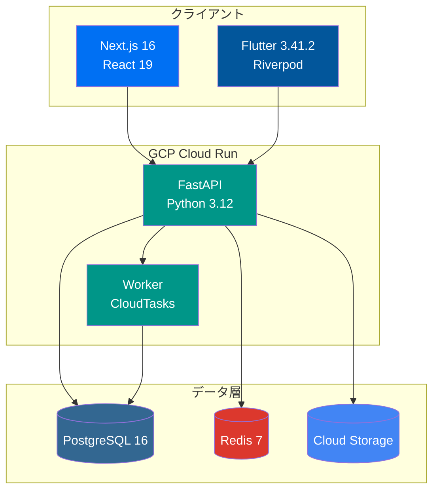
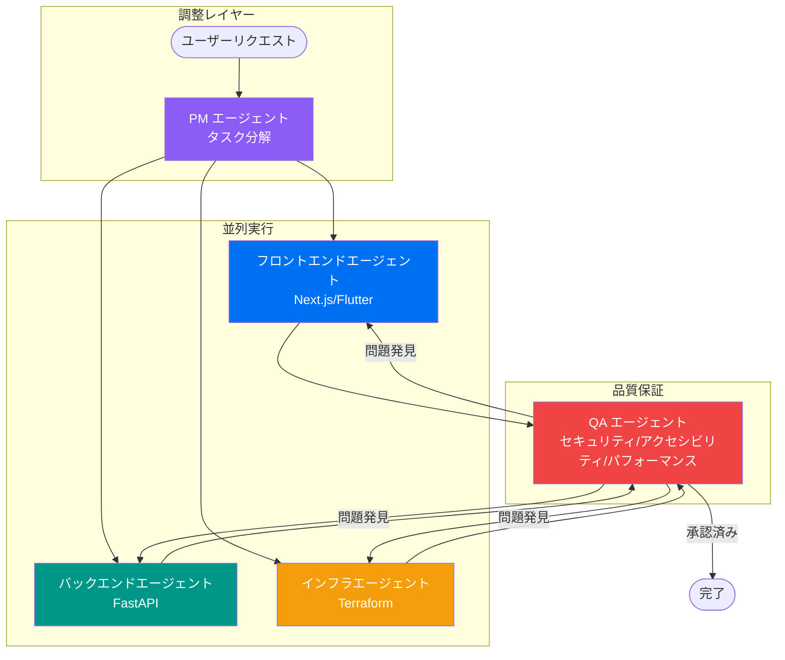

# Fullstack Starter

[](https://github.com/first-fluke/fullstack-starter/stargazers)
[](https://github.com/first-fluke/fullstack-starter)
[](https://github.com/first-fluke/fullstack-starter/releases)
[](https://deepwiki.com/first-fluke/fullstack-starter)

[English](../README.md) | [한국어](./README.ko.md) | [简体中文](./README.cn.md) | 日本語

> テンプレートのバージョン管理は [Release Please](https://github.com/googleapis/release-please) により行われます — リリース履歴は [CHANGELOG.md](../CHANGELOG.md) をご覧ください。

Next.js 16、FastAPI、Flutter、GCP インフラを統合した、本番環境対応のフルスタック monorepo テンプレートです。

### 3 層アーキテクチャ



## 主な機能

- **モダンスタック**: Next.js 16 + React 19、FastAPI、Flutter 3.41.2、TailwindCSS v4
- **型安全性**: TypeScript、Pydantic、Dartによるフルスタックの型サポート
- **認証**: better-auth ベースの OAuth（Google、GitHub、Facebook）
- **国際化 (i18n)**: next-intl（Web）、Flutter ARB（モバイル）、共有 i18n パッケージ
- **APIクライアント自動生成**: Orval（Web）、swagger_parser（モバイル）
- **インフラストラクチャ as Code**: Terraform + GCP（Cloud Run、Cloud SQL、Cloud Storage）
- **CI/CD**: GitHub Actions + Workload Identity Federation（キーレスデプロイ）
- **AIエージェントサポート**: AIコーディングエージェント（Gemini、Claude など）向けガイドライン
- **mise Monorepo**: mise ベースのタスク管理と統一ツールバージョン

## 技術スタック

| レイヤー | 技術 |
|------|------|
| **フロントエンド** | Next.js 16、React 19、TailwindCSS v4、shadcn/ui、TanStack Query、Jotai |
| **バックエンド** | FastAPI、SQLAlchemy (async)、PostgreSQL 16、Redis 7 |
| **モバイル** | Flutter 3.41.2、Riverpod 3、go_router 17、Firebase Crashlytics、Fastlane |
| **ワーカー** | FastAPI + CloudTasks/PubSub |
| **インフラストラクチャ** | Terraform、GCP（Cloud Run、Cloud SQL、Cloud Storage、CDN） |
| **CI/CD** | GitHub Actions、Workload Identity Federation |
| **ツール管理** | mise（Node、Python、Flutter、Terraform バージョンの統一） |

> **[なぜこの技術スタックか？](./WHY.jp.md)** — 各技術選択の詳細な理由。


## AI エージェントオーケストレーション

このテンプレートには、複雑なクロスドメインタスクのためのマルチエージェント協調ワークフローが含まれています。



| エージェント | 役割 |
|--------|------|
| **PM エージェント** | 要件分析、API コントラクト定義、優先度付きタスク分解の作成 |
| **ドメインエージェント** | フロントエンド、バックエンド、モバイル、インフラエージェントが優先度順に並列実行 |
| **QA エージェント** | セキュリティ（OWASP）、パフォーマンス、アクセシビリティ（WCAG 2.1 AA）のレビュー |

> 完全なオーケストレーションワークフローは [`.agent/workflows/coordinate.md`](../.agent/workflows/coordinate.md) をご覧ください。

## クイックスタート

このテンプレートを使い始めるには、以下のいずれかの方法を選択してください：

```bash
# CLI から作成
bun create fullstack-starter my-app
# または
npm create fullstack-starter my-app
```

または GitHub を使用：

1. **[Use this template](https://github.com/first-fluke/fullstack-starter/generate)** をクリックして新しいリポジトリを作成
2. またはこのリポジトリを **[Fork](https://github.com/first-fluke/fullstack-starter/fork)**

### 前提条件

**すべてのプラットフォームで必須：**
- [mise](https://mise.jdx.dev/) - ランタイムバージョンマネージャー
- [Docker](https://www.docker.com/) または [Podman Desktop](https://podman-desktop.io/downloads) - ローカルインフラ

**モバイル開発用（iOS/Android）：**
- [Xcode](https://apps.apple.com/app/xcode/id497799835) - iOS シミュレーター含む（macOS のみ）
- [Android Studio](https://developer.android.com/studio) - Android SDK とエミュレーター含む

**オプション：**
- [Terraform](https://www.terraform.io/) - クラウドインフラ

### 1. ランタイムのインストール

```bash
# mise のインストール（未インストールの場合）
curl https://mise.run | sh

# すべてのランタイムをインストール（Node 24、Python 3.12、Flutter 3、bun、uv、Terraform）
mise install
```

### 2. 依存関係のインストール

```bash
# すべての依存関係を一度にインストール
mise run install
```

### 3. ローカルインフラの起動

```bash
mise infra:up
```

これにより以下が起動されます：
- PostgreSQL (5432)
- Redis (6379)
- MinIO (9000、9001)

### 4. データベースマイグレーションの実行

```bash
mise db:migrate
```

### 5. 開発サーバーの起動

```bash
# API と Web サービスを起動（Web 開発時におすすめ）
mise dev:web

# API と Mobile サービスを起動（モバイル開発時におすすめ）
mise dev:mobile

# またはすべてのサービスを起動
mise dev
```

## プロジェクト構造

```
fullstack-starter/
├── apps/
│   ├── api/           # FastAPI バックエンド
│   ├── web/           # Next.js フロントエンド
│   ├── worker/        # バックグラウンドワーカー
│   ├── mobile/        # Flutter モバイルアプリ
│   └── infra/         # Terraform インフラ
├── packages/
│   ├── design-tokens/ # 共有デザイントークン（信頼できる唯一の情報源）
│   └── i18n/          # 共有 i18n パッケージ（信頼できる唯一の情報源）
├── .agent/rules/      # AI エージェントガイドライン
├── .serena/           # Serena MCP 設定
└── .github/workflows/ # CI/CD
```

## コマンド

### mise Monorepo タスク

このプロジェクトは mise monorepo モードを使用し、`//path:task` 構文をサポートしています。

```bash
# 利用可能なすべてのタスクを一覧表示
mise tasks --all
```

| コマンド | 説明 |
|---------|-------------|
| `mise db:migrate` | データベースマイグレーションを実行 |
| `mise dev` | すべてのサービスを起動 |
| `mise dev:web` | API と Web サービスを起動 |
| `mise dev:mobile` | API と Mobile サービスを起動 |
| `mise format` | すべてのアプリをフォーマット |
| `mise gen:api` | OpenAPI スキーマと API クライアントを生成 |
| `mise i18n:build` | i18n ファイルをビルド |
| `mise infra:down` | ローカルインフラを停止 |
| `mise infra:up` | ローカルインフラを起動 |
| `mise lint` | すべてのアプリをリント |
| `mise run install` | すべての依存関係をインストール |
| `mise test` | すべてのアプリをテスト |
| `mise tokens:build` | デザイントークンをビルド |
| `mise typecheck` | 型チェック |

### アプリ別タスク

<details>
<summary>API (apps/api)</summary>

| コマンド | 説明 |
|---------|-------------|
| `mise //apps/api:install` | 依存関係をインストール |
| `mise //apps/api:dev` | 開発サーバーを起動 |
| `mise //apps/api:test` | テストを実行 |
| `mise //apps/api:lint` | リントを実行 |
| `mise //apps/api:format` | コードをフォーマット |
| `mise //apps/api:typecheck` | 型チェック |
| `mise //apps/api:migrate` | マイグレーションを実行 |
| `mise //apps/api:migrate:create` | 新しいマイグレーションを作成 |
| `mise //apps/api:gen:openapi` | OpenAPI スキーマを生成 |
| `mise //apps/api:infra:up` | ローカルインフラを起動 |
| `mise //apps/api:infra:down` | ローカルインフラを停止 |

</details>

<details>
<summary>Web (apps/web)</summary>

| コマンド | 説明 |
|---------|-------------|
| `mise //apps/web:install` | 依存関係をインストール |
| `mise //apps/web:dev` | 開発サーバーを起動 |
| `mise //apps/web:build` | プロダクションビルド |
| `mise //apps/web:test` | テストを実行 |
| `mise //apps/web:lint` | リントを実行 |
| `mise //apps/web:format` | コードをフォーマット |
| `mise //apps/web:typecheck` | 型チェック |
| `mise //apps/web:gen:api` | API クライアントを生成 |

</details>

<details>
<summary>Mobile (apps/mobile)</summary>

| コマンド | 説明 |
|---------|-------------|
| `mise //apps/mobile:install` | 依存関係をインストール |
| `mise //apps/mobile:dev` | デバイス/シミュレーターで実行 |
| `mise //apps/mobile:build` | ビルド |
| `mise //apps/mobile:test` | テストを実行 |
| `mise //apps/mobile:lint` | アナライザーを実行 |
| `mise //apps/mobile:format` | コードをフォーマット |
| `mise //apps/mobile:gen:l10n` | ローカリゼーションファイルを生成 |
| `mise //apps/mobile:gen:api` | API クライアントを生成 |

</details>

<details>
<summary>Worker (apps/worker)</summary>

| コマンド | 説明 |
|---------|-------------|
| `mise //apps/worker:install` | 依存関係をインストール |
| `mise //apps/worker:dev` | ワーカーを起動 |
| `mise //apps/worker:test` | テストを実行 |
| `mise //apps/worker:lint` | リントを実行 |
| `mise //apps/worker:format` | コードをフォーマット |

</details>

<details>
<summary>インフラストラクチャ (apps/infra)</summary>

| コマンド | 説明 |
|---------|-------------|
| `mise //apps/infra:init` | Terraform を初期化 |
| `mise //apps/infra:plan` | 変更をプレビュー |
| `mise //apps/infra:apply` | 変更を適用 |
| `mise //apps/infra:plan:prod` | プロダクションをプレビュー |
| `mise //apps/infra:apply:prod` | プロダクションを適用 |

</details>

<details>
<summary>i18n (packages/i18n)</summary>

| コマンド | 説明 |
|---------|-------------|
| `mise //packages/i18n:install` | 依存関係をインストール |
| `mise //packages/i18n:build` | Web とモバイル用の i18n ファイルをビルド |
| `mise //packages/i18n:build:web` | Web 用のみビルド |
| `mise //packages/i18n:build:mobile` | モバイル用のみビルド |

</details>

<details>
<summary>デザイントークン (packages/design-tokens)</summary>

| コマンド | 説明 |
|---------|-------------|
| `mise //packages/design-tokens:install` | 依存関係をインストール |
| `mise //packages/design-tokens:build` | Web とモバイル用のトークンをビルド |
| `mise //packages/design-tokens:dev` | 開発用ウォッチモード |
| `mise //packages/design-tokens:test` | テストを実行 |

</details>

## 国際化 (i18n)

`packages/i18n` は i18n リソースの信頼できる唯一の情報源です。

```bash
# i18n ファイルを編集
packages/i18n/src/en.arb  # 英語（デフォルト）
packages/i18n/src/ko.arb  # 韓国語
packages/i18n/src/ja.arb  # 日本語

# ビルドして各アプリにデプロイ
mise i18n:build
# 生成されるファイル：
# - apps/web/src/config/messages/*.json (ネストされた JSON)
# - apps/mobile/lib/i18n/messages/app_*.arb (Flutter ARB)
```

## デザイントークン

`packages/design-tokens` はデザイントークン（色、間隔など）の信頼できる唯一の情報源です。

```bash
# トークンを編集
packages/design-tokens/src/tokens.ts

# ビルドして配布
mise tokens:build
# 生成されるファイル：
# - apps/web/src/app/[locale]/tokens.css (CSS 変数)
# - apps/mobile/lib/core/theme/generated_theme.dart (Flutter テーマ)
```

## 設定

### 環境変数

サンプルファイルをコピーして設定：

```bash
# API
cp apps/api/.env.example apps/api/.env

# Web
cp apps/web/.env.example apps/web/.env

# Infra
cp apps/infra/terraform.tfvars.example apps/infra/terraform.tfvars
```

### GitHub Actions Secrets

リポジトリに以下の Secrets を設定：

| Secret | 説明 |
|--------|-------------|
| `GCP_PROJECT_ID` | GCP プロジェクト ID |
| `GCP_REGION` | GCP リージョン（例：`asia-northeast3`） |
| `WORKLOAD_IDENTITY_PROVIDER` | Terraform 出力から取得 |
| `GCP_SERVICE_ACCOUNT` | Terraform 出力から取得 |
| `FIREBASE_SERVICE_ACCOUNT_JSON` | Firebase サービスアカウント JSON（モバイルデプロイ用） |
| `FIREBASE_ANDROID_APP_ID` | Firebase Android アプリ ID |

### Firebase（モバイル）

1. FlutterFire CLI をインストール：

```bash
dart pub global activate flutterfire_cli
```

2. プロジェクトの Firebase を設定：

```bash
cd apps/mobile
flutterfire configure
```

これにより Firebase 設定を含む `lib/firebase_options.dart` が生成されます。

## デプロイ

### GitHub Actions（推奨）

`main` ブランチへのプッシュで自動デプロイがトリガーされます：
- `apps/api/` の変更 → API をデプロイ
- `apps/web/` の変更 → Web をデプロイ
- `apps/worker/` の変更 → Worker をデプロイ
- `apps/mobile/` の変更 → Firebase App Distribution へビルド＆デプロイ

### 手動デプロイ

```bash
# Docker イメージをビルドしてプッシュ
cd apps/api
docker build -t gcr.io/PROJECT_ID/api .
docker push gcr.io/PROJECT_ID/api

# Cloud Run にデプロイ
gcloud run deploy api --image gcr.io/PROJECT_ID/api --region REGION
```

### モバイル（Fastlane）

モバイルアプリは Fastlane を使用してビルド自動化とデプロイを行います。

```bash
cd apps/mobile

# Ruby 依存関係をインストール
bundle install

# 利用可能な Lane
bundle exec fastlane android build       # APK をビルド
bundle exec fastlane android firebase    # Firebase App Distribution にデプロイ
bundle exec fastlane android internal    # Play Store（内部テスト）にデプロイ
bundle exec fastlane ios build           # iOS をビルド（コード署名なし）
bundle exec fastlane ios testflight_deploy  # TestFlight にデプロイ
```

## AI エージェントサポート

このテンプレートは AI コーディングエージェント（Gemini、Claude など）との協働を考慮して設計されています。

- `.agent/rules/` - AI エージェント用ガイドライン
- `.serena/` - Serena MCP 設定

> [oh-my-ag](https://github.com/first-fluke/oh-my-ag) を試して、AI コーディングエージェントの生産性を最大化しましょう。

## ドキュメント

- [ビルドガイド](../.agent/rules/build-guide.md)
- [リント＆フォーマットガイド](../.agent/rules/lint-format-guide.md)
- [テストガイド](../.agent/rules/test-guide.md)

## ライセンス

MIT

## スポンサー

このプロジェクトがお役に立ちましたら、コーヒーをご馳走ください！

<a href="https://www.buymeacoffee.com/firstfluke" target="_blank"></a>

または Star を付けてください：

```bash
gh api --method PUT /user/starred/first-fluke/fullstack-starter
```

## Star 履歴

[](https://www.star-history.com/#first-fluke/fullstack-starter&type=date&legend=bottom-right)
