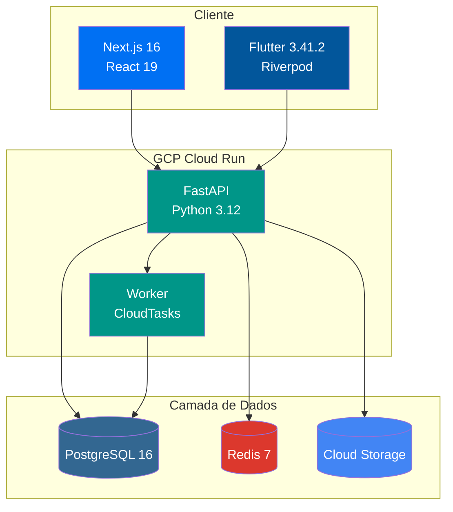
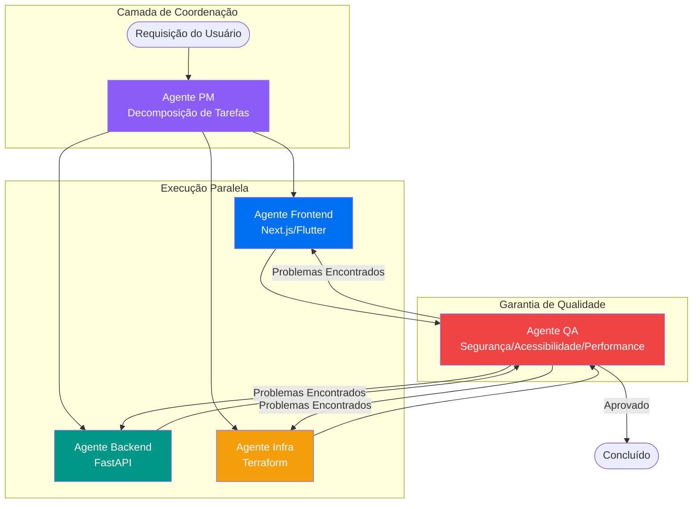

# Fullstack Starter

[](https://github.com/first-fluke/fullstack-starter/stargazers)
[](https://github.com/first-fluke/fullstack-starter)
[](https://github.com/first-fluke/fullstack-starter/releases)
[](https://deepwiki.com/first-fluke/fullstack-starter)

[English](../README.md) | [한국어](./README.ko.md) | [简体中文](./README.cn.md) | [日本語](./README.jp.md) | Português

> O versionamento do template é gerenciado via [Release Please](https://github.com/googleapis/release-please) — consulte o [CHANGELOG.md](../CHANGELOG.md) para o histórico de releases.

Template monorepo fullstack pronto para produção com Next.js 16, FastAPI, Flutter e infraestrutura GCP.

### Arquitetura de 3 Camadas



## Principais Recursos

- **Stack Moderno**: Next.js 16 + React 19, FastAPI, Flutter 3.41.2, TailwindCSS v4
- **Segurança de Tipos**: Suporte completo de tipos com TypeScript, Pydantic e Dart
- **Autenticação**: OAuth com better-auth (Google, GitHub, Facebook)
- **Internacionalização (i18n)**: next-intl (web), Flutter ARB (mobile), pacote i18n compartilhado
- **Clientes API Auto-gerados**: Orval (web), swagger_parser (mobile)
- **Infraestrutura como Código**: Terraform + GCP (Cloud Run, Cloud SQL, Cloud Storage)
- **CI/CD**: GitHub Actions + Workload Identity Federation (deploy sem chaves)
- **Suporte a Agentes de IA**: Diretrizes para agentes de codificação de IA (Gemini, Claude, etc.)
- **Monorepo com mise**: Gerenciamento de tarefas baseado em mise e versões unificadas de ferramentas

## Stack Tecnológico

| Camada | Tecnologia |
|--------|------------|
| **Frontend** | Next.js 16, React 19, TailwindCSS v4, shadcn/ui, TanStack Query, Jotai |
| **Backend** | FastAPI, SQLAlchemy (async), PostgreSQL 16, Redis 7 |
| **Mobile** | Flutter 3.41.2, Riverpod 3, go_router 17, Firebase Crashlytics, Fastlane |
| **Worker** | FastAPI + CloudTasks/PubSub |
| **Infraestrutura** | Terraform, GCP (Cloud Run, Cloud SQL, Cloud Storage, CDN) |
| **CI/CD** | GitHub Actions, Workload Identity Federation |
| **Gerenciamento de Ferramentas** | mise (versões unificadas de Node, Python, Flutter, Terraform) |

> **[Por que esta stack tecnológica?](./WHY.pt.md)** — Explicação detalhada por trás de cada escolha tecnológica.


## Orquestração de Agentes de IA

Este template inclui um fluxo de trabalho de coordenação multi-agente para tarefas complexas entre domínios.



| Agente | Função |
|--------|--------|
| **Agente PM** | Analisa requisitos, define contratos de API, cria decomposição de tarefas priorizada |
| **Agentes de Domínio** | Agentes Frontend, Backend, Mobile, Infra executam tarefas em paralelo por prioridade |
| **Agente QA** | Revisa segurança (OWASP), performance, acessibilidade (WCAG 2.1 AA) |

> Consulte [`.agents/workflows/coordinate.md`](../.agents/workflows/coordinate.md) para o fluxo de orquestração completo.

## Início Rápido

Escolha um dos métodos a seguir para começar com este template:

```bash
# Criar via CLI
bun create fullstack-starter my-app
# ou
npm create fullstack-starter my-app
```

Ou use o GitHub:

1. Clique em **[Use this template](https://github.com/first-fluke/fullstack-starter/generate)** para criar um novo repositório
2. Ou **[Fork](https://github.com/first-fluke/fullstack-starter/fork)** este repositório

### Pré-requisitos

**Obrigatório para todas as plataformas:**
- [mise](https://mise.jdx.dev/) - Gerenciador de versões de runtime
- [Docker](https://www.docker.com/) ou [Podman Desktop](https://podman-desktop.io/downloads) - Infraestrutura local

**Para desenvolvimento mobile (iOS/Android):**
- [Xcode](https://apps.apple.com/app/xcode/id497799835) - Inclui iOS Simulator (apenas macOS)
- [Android Studio](https://developer.android.com/studio) - Inclui Android SDK e emulador

**Opcional:**
- [Terraform](https://www.terraform.io/) - Infraestrutura em nuvem

### 1. Instalar Runtimes

```bash
# Instalar mise (se não estiver instalado)
curl https://mise.run | sh

# Confiar na configuração do projeto (necessário no primeiro clone)
mise trust

# Instalar todos os runtimes (Node 24, Python 3.12, Flutter 3, bun, uv, Terraform)
mise install
```

### 2. Instalar Dependências

```bash
# Instalar todas as dependências de uma vez
mise run install
```

### 3. Iniciar Infraestrutura Local

```bash
mise infra:up
```

Isso inicia:
- PostgreSQL (5432)
- Redis (6379)
- MinIO (9000, 9001)

### 4. Executar Migrações do Banco de Dados

```bash
mise db:migrate
```

### 5. Iniciar Servidores de Desenvolvimento

```bash
# Iniciar serviços de API e Web (recomendado para desenvolvimento web)
mise dev:web

# Iniciar serviços de API e Mobile (recomendado para desenvolvimento mobile)
mise dev:mobile

# Ou iniciar todos os serviços
mise dev
```

## Estrutura do Projeto

```
fullstack-starter/
├── apps/
│   ├── api/           # Backend FastAPI
│   ├── web/           # Frontend Next.js
│   ├── worker/        # Worker em segundo plano
│   ├── mobile/        # App mobile Flutter
│   └── infra/         # Infraestrutura Terraform
├── packages/
│   ├── design-tokens/ # Design tokens compartilhados (Fonte da Verdade)
│   └── i18n/          # Pacote i18n compartilhado (Fonte da Verdade)
├── .agents/rules/      # Diretrizes para agentes de IA
├── .serena/           # Configuração Serena MCP
└── .github/workflows/ # CI/CD
```

## Comandos

### Tarefas do Monorepo mise

Este projeto usa o modo monorepo do mise com sintaxe `//path:task`.

```bash
# Listar todas as tarefas disponíveis
mise tasks --all
```

| Comando | Descrição |
|---------|-----------|
| `mise db:migrate` | Executar migrações do banco de dados |
| `mise dev` | Iniciar todos os serviços |
| `mise dev:web` | Iniciar serviços de API e Web |
| `mise dev:mobile` | Iniciar serviços de API e Mobile |
| `mise format` | Formatar todos os apps |
| `mise gen:api` | Gerar schema OpenAPI e clientes API |
| `mise i18n:build` | Compilar arquivos i18n |
| `mise infra:down` | Parar infraestrutura local |
| `mise infra:up` | Iniciar infraestrutura local |
| `mise lint` | Executar lint em todos os apps |
| `mise run install` | Instalar todas as dependências |
| `mise test` | Testar todos os apps |
| `mise tokens:build` | Compilar design tokens |
| `mise typecheck` | Verificação de tipos |

### Tarefas Específicas por App

<details>
<summary>API (apps/api)</summary>

| Comando | Descrição |
|---------|-----------|
| `mise //apps/api:install` | Instalar dependências |
| `mise //apps/api:dev` | Iniciar servidor de desenvolvimento |
| `mise //apps/api:test` | Executar testes |
| `mise //apps/api:lint` | Executar linter |
| `mise //apps/api:format` | Formatar código |
| `mise //apps/api:typecheck` | Verificação de tipos |
| `mise //apps/api:migrate` | Executar migrações |
| `mise //apps/api:migrate:create` | Criar nova migração |
| `mise //apps/api:gen:openapi` | Gerar schema OpenAPI |
| `mise //apps/api:infra:up` | Iniciar infraestrutura local |
| `mise //apps/api:infra:down` | Parar infraestrutura local |

</details>

<details>
<summary>Web (apps/web)</summary>

| Comando | Descrição |
|---------|-----------|
| `mise //apps/web:install` | Instalar dependências |
| `mise //apps/web:dev` | Iniciar servidor de desenvolvimento |
| `mise //apps/web:build` | Build de produção |
| `mise //apps/web:test` | Executar testes |
| `mise //apps/web:lint` | Executar linter |
| `mise //apps/web:format` | Formatar código |
| `mise //apps/web:typecheck` | Verificação de tipos |
| `mise //apps/web:gen:api` | Gerar cliente API |

</details>

<details>
<summary>Mobile (apps/mobile)</summary>

| Comando | Descrição |
|---------|-----------|
| `mise //apps/mobile:install` | Instalar dependências |
| `mise //apps/mobile:dev` | Executar em dispositivo/emulador |
| `mise //apps/mobile:build` | Compilar |
| `mise //apps/mobile:test` | Executar testes |
| `mise //apps/mobile:lint` | Executar analyzer |
| `mise //apps/mobile:format` | Formatar código |
| `mise //apps/mobile:gen:l10n` | Gerar localizações |
| `mise //apps/mobile:gen:api` | Gerar cliente API |

</details>

<details>
<summary>Worker (apps/worker)</summary>

| Comando | Descrição |
|---------|-----------|
| `mise //apps/worker:install` | Instalar dependências |
| `mise //apps/worker:dev` | Iniciar worker |
| `mise //apps/worker:test` | Executar testes |
| `mise //apps/worker:lint` | Executar linter |
| `mise //apps/worker:format` | Formatar código |

</details>

<details>
<summary>Infraestrutura (apps/infra)</summary>

| Comando | Descrição |
|---------|-----------|
| `mise //apps/infra:init` | Inicializar Terraform |
| `mise //apps/infra:plan` | Visualizar alterações |
| `mise //apps/infra:apply` | Aplicar alterações |
| `mise //apps/infra:plan:prod` | Visualizar produção |
| `mise //apps/infra:apply:prod` | Aplicar produção |

</details>

<details>
<summary>i18n (packages/i18n)</summary>

| Comando | Descrição |
|---------|-----------|
| `mise //packages/i18n:install` | Instalar dependências |
| `mise //packages/i18n:build` | Compilar arquivos i18n para web e mobile |
| `mise //packages/i18n:build:web` | Compilar apenas para web |
| `mise //packages/i18n:build:mobile` | Compilar apenas para mobile |

</details>

<details>
<summary>Design Tokens (packages/design-tokens)</summary>

| Comando | Descrição |
|---------|-----------|
| `mise //packages/design-tokens:install` | Instalar dependências |
| `mise //packages/design-tokens:build` | Compilar tokens para web e mobile |
| `mise //packages/design-tokens:dev` | Modo watch para desenvolvimento |
| `mise //packages/design-tokens:test` | Executar testes |

</details>

## Internacionalização (i18n)

O `packages/i18n` é a Fonte da Verdade para recursos i18n.

```bash
# Editar arquivos i18n
packages/i18n/src/en.arb  # Inglês (padrão)
packages/i18n/src/ko.arb  # Coreano
packages/i18n/src/ja.arb  # Japonês
packages/i18n/src/pt.arb  # Português

# Compilar e implantar em cada app
mise i18n:build
# Arquivos gerados:
# - apps/web/src/config/messages/*.json (JSON Aninhado)
# - apps/mobile/lib/i18n/messages/app_*.arb (Flutter ARB)
```

## Design Tokens

O `packages/design-tokens` é a Fonte da Verdade para design tokens (cores, espaçamento, etc.).

```bash
# Editar tokens
packages/design-tokens/src/tokens.ts

# Compilar e distribuir
mise tokens:build
# Arquivos gerados:
# - apps/web/src/app/[locale]/tokens.css (Variáveis CSS)
# - apps/mobile/lib/core/theme/generated_theme.dart (Tema Flutter)
```

## Configuração

### Variáveis de Ambiente

Copie os arquivos de exemplo e configure:

```bash
# API
cp apps/api/.env.example apps/api/.env

# Web
cp apps/web/.env.example apps/web/.env

# Infra
cp apps/infra/terraform.tfvars.example apps/infra/terraform.tfvars
```

### Secrets do GitHub Actions

Configure estes secrets no seu repositório:

| Secret | Descrição |
|--------|-----------|
| `GCP_PROJECT_ID` | ID do projeto GCP |
| `GCP_REGION` | Região do GCP (ex: `asia-northeast3`) |
| `WORKLOAD_IDENTITY_PROVIDER` | Da saída do Terraform |
| `GCP_SERVICE_ACCOUNT` | Da saída do Terraform |
| `FIREBASE_SERVICE_ACCOUNT_JSON` | Conta de serviço Firebase JSON (para deploy mobile) |
| `FIREBASE_ANDROID_APP_ID` | ID do app Android Firebase |

### Firebase (Mobile)

1. Instale o FlutterFire CLI:

```bash
dart pub global activate flutterfire_cli
```

2. Configure o Firebase para seu projeto:

```bash
cd apps/mobile
flutterfire configure
```

Isso gera o arquivo `lib/firebase_options.dart` com sua configuração Firebase.

## Deploy

### GitHub Actions (Recomendado)

Push para a branch `main` aciona o deploy automático:
- Alterações em `apps/api/` → Deploy da API
- Alterações em `apps/web/` → Deploy do Web
- Alterações em `apps/worker/` → Deploy do Worker
- Alterações em `apps/mobile/` → Build & Deploy para Firebase App Distribution

### Deploy Manual

```bash
# Compilar e fazer push das imagens Docker
cd apps/api
docker build -t gcr.io/PROJECT_ID/api .
docker push gcr.io/PROJECT_ID/api

# Deploy para Cloud Run
gcloud run deploy api --image gcr.io/PROJECT_ID/api --region REGION
```

### Mobile (Fastlane)

O app mobile usa Fastlane para automação de build e deploy.

```bash
cd apps/mobile

# Instalar dependências Ruby
bundle install

# Lanes disponíveis
bundle exec fastlane android build       # Compilar APK
bundle exec fastlane android firebase    # Deploy para Firebase App Distribution
bundle exec fastlane android internal    # Deploy para Play Store (interno)
bundle exec fastlane ios build           # Compilar iOS (sem codesign)
bundle exec fastlane ios testflight_deploy  # Deploy para TestFlight
```

## Suporte a Agentes de IA

Este template é projetado para trabalhar com agentes de codificação de IA (Gemini, Claude, etc.).

- `.agents/rules/` - Diretrizes para agentes de IA
- `.serena/` - Configuração Serena MCP

> Experimente [oh-my-agent](https://github.com/first-fluke/oh-my-agent) para maximizar a produtividade com agentes de codificação de IA.

## Documentação

- [Guia de Build](../.agents/rules/build-guide.md)
- [Guia de Lint & Formatação](../.agents/rules/lint-format-guide.md)
- [Guia de Testes](../.agents/rules/test-guide.md)

## Licença

MIT

## Patrocinadores

Se este projeto te ajudou, considere me comprar um café!

<a href="https://www.buymeacoffee.com/firstfluke" target="_blank"></a>

Ou deixe uma estrela:

```bash
gh api --method PUT /user/starred/first-fluke/fullstack-starter
```

## Histórico de Estrelas

[](https://www.star-history.com/#first-fluke/fullstack-starter&type=date&legend=bottom-right)
